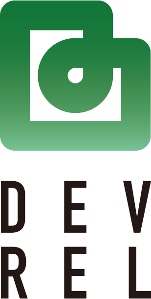
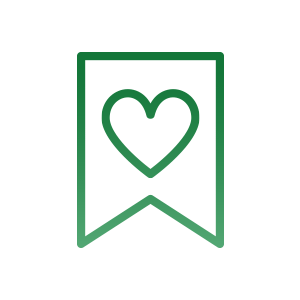
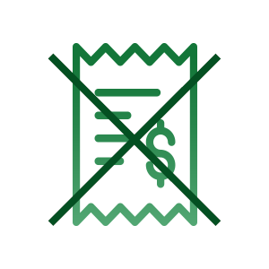

<main class="l-main" role="main">
  <section class="tp-hero">
    <h1 class="tp-hero__img-wrapper"></h1>
  </section>
  
  <section class="tp-section tp-section--gray">
    

      

        

          

          <h2 class="tp-section-header__title">DevRel?</h2>
            <h2 class="tp-section-header__title-ja is-ja">デブレルとは？</h2>
          

        

        

          <h3 class="tp-header is-ja">About DEVREL(Developer Relations)</h3>
          

            ■ Can't spread service in the world 
            ■ Competiters are attacking with advertising and sales power 
            ■ Don't know how to make differs from other companies 
            Advances in IT technology are creating new services every day. In addition, popular services come out with services of the same concept in a matter of seconds. Under such circumstances, there are many who are wondering how to differentiate from other companies and how to spread them.  
            It is DEVREL that can help. DEVREL stands for Developer Relations, which is a marketing activity that forms links with external developers and makes them aware of their products / services.
          

          

            
<a href="/about" class="c-btn c-btn--viewmore">VIEW MORE</a>

          

        
 <!-- / .col  -->
      
 <!-- / .row  -->
    
<!-- /.container -->
  </section>

  
  <section class="tp-section tp-section">
    

      

        

          

            <h2 class="tp-section-header__title">MISSON</h2>
            <h2 class="tp-section-header__title-ja is-ja">ミッション</h2>
          

        

        

            <h3 class="tp-header is-ja">Marketing activities linking developers and products / services</h3>
            

            Marketing is an activity that delivers your product information to customers. Even if it is a developer, it does not change, and it is necessary to deliver product and service information to them. Developers rarely see ads and are not effective. Therefore, hosting and participating in blogs and meetups, and purchasing through social media are effective. In contrast to advertising, day-to-day activities connect developers with products.
            

            <h3 class="tp-header is-en">For whom and what world will be realized</h3>
            

              <dl class="missionIcons__item">
                <dt></dt>
                <dd class="is-ja">Awareness</dd>
              </dl>
              <dl class="missionIcons__item">
                <dt></dt>
                <dd class="is-ja">User</dd>
              </dl>
              <dl class="missionIcons__item">
                <dt></dt>
                <dd class="is-ja">Utilize information</dd>
              </dl>
              <dl class="missionIcons__item">
                <dt></dt>
                <dd class="is-ja">No Ads</dd>
              </dl>
            
<!--//.missionIcons-->

          
Let's solve it by DEVREL!

          
<a href="/mission" class="c-btn c-btn--viewmore">VIEW MORE</a>

        
 <!-- / .col  -->
      
 <!-- / .row  -->
    
<!-- /.container -->
  </section>

  
  <section class="tp-section tp-section--gray">
    

      

        

          
 
            <h2 class="tp-section-header__title">Service</h2>
            <h2 class="tp-section-header__title-ja is-ja">サービス</h2>
          

        

        

          <h3 class="tp-header is-ja">Main features and price</h3>
          

          We mainly focus on evangelists, writing blogs and documents, holding events, and fostering communities. In addition, I work on all aspects of DevRel, such as creating videos, creating demo codes, and writing electronic books.
          

          

            <dl class="serviceIcon__item">
              <dt></dt>
              <dd class="serviceIcon__en">Code</dd>
              <dd class="serviceIcon__ja">コード</dd>
            </dl>
            <dl class="serviceIcon__item">
              <dt></dt>
              <dd class="serviceIcon__en">Content</dd>
              <dd class="serviceIcon__ja">コンテンツ</dd>
            </dl>
            <dl class="serviceIcon__item">
              <dt></dt>
              <dd class="serviceIcon__en">Conductor</dd>
              <dd class="serviceIcon__ja">コンダクター</dd>
            </dl>
            <dl class="serviceIcon__item">
              <dt></dt>
              <dd class="serviceIcon__en">Communication</dd>
              <dd class="serviceIcon__ja">コミュニケーション</dd>
            </dl>

          
<!--//.serviceIcon-->

          
Know more detail of DEVREL!

          
<a href="/service" class="c-btn c-btn--viewmore">VIEW MORE</a>

      
 <!-- / .col  -->
    
 <!-- / .row  -->
    
<!-- /.container -->
  </section>

  
  <section class="tp-section">
    

      

        

          

            <h2 class="tp-section-header__title">CLIENT</h2>
            <h2 class="tp-section-header__title-ja is-ja">クライアント</h2>
          

        

        

          <h3 class="tp-header is-ja">We support them</h3>
          

          We support DevRel, a technology company inside and outside Japan. A wide range of technologies, from start-ups to enterprise companies, is involved in a wide range of technologies, including smartphone apps, the Web, and block chains.
          

          

            <dl class="clientIcon__item">
              <dt></dt>
              <dd class="is-ja">nifcloud mobile backned</dd>
            </dl>

            <dl class="clientIcon__item">
              <dt></dt>
              <dd class="is-ja">hifive</dd>
            </dl>

            <dl class="clientIcon__item">
              <dt></dt>
              <dd class="is-ja">NTT Communications Corporation</dd>
            </dl>
          
<!--//.clients-->

          
<a href="/client" class="c-btn c-btn--viewmore">VIEW MORE</a>

        
<!--//.col-md-9-->
      
 <!-- / .row  -->
    
<!-- /.container -->
  </section>

  
  <section class="tp-section tp-section--gray">
    

      

        

          

            <h2 class="tp-section-header__title">BLOG</h2>
            <h2 class="tp-section-header__title-ja is-ja">ブログ</h2>
          

        

        

          
            

              
<a href="{{ post.url }}">
                
                  </a>
                
                  </a>
                
              

              

                <h3 class="blogHead__detail__title">
                  <a href="{{ post.url }}">{{ post.title }}</a>
                </h3>
                <ul class="blogHead__detail__meta">
                  <li class="blogHead__detail__date">{{ post.date | date: '%Y/%m/%d' }}</li>
                  
                    <li class="blogHead__detail__cat"><a href="/category/{{ category | cgi_escape}}.html">{{ category }}</a></li>
                  
                </ul>
              

            
<!--//.blogHead-->
          
          
<a href="/blog" class="c-btn c-btn--viewmore">VIEW MORE</a>

        
 <!-- / .col  -->
      
 <!-- / .row  -->
    
<!-- /.container -->
  </section>

  
  <section class="tp-section">
    

      

        

          

            <h2 class="tp-section-header__title">ABOUT</h2>
            <h2 class="tp-section-header__title-ja is-ja">会社概要</h2>
          

        

        

          <table>
            <tbody class="c-table__body">
              <tr class="c-table__row">
                <th class="c-table__th is-ja">Company Name</th>
                <td class="c-table__td is-ja">MOONGIFT Inc.</td>
              </tr>
              <tr class="c-table__row">
                <th class="c-table__th is-ja">Address</th>
                <td class="c-table__td is-ja">〒231-0021 Nihon-ohdouri 7 Building 4F YBP, Nihon-ohdouri, Naka-ku, Yokohama-Shi, Kanagawa, Japan</td>
              </tr>
              <tr class="c-table__row">
                <th class="c-table__th is-ja">E-mail</th>
                <td class="c-table__td is-ja">info@moongift.jp</td>
              </tr>
              <tr class="c-table__row">
                <th class="c-table__th is-ja">Board Member</th>
                <td class="c-table__td is-ja">CEO Atsushi Nakatsugawa</td>
              </tr>
              <tr class="c-table__row">
                <th class="c-table__th is-ja">Capital Stock</th>
                <td class="c-table__td is-ja">¥2,000,000</td>
              </tr>
            </tbody>
          </table>

          
<a href="https://moongift.co.jp/" class="c-btn c-btn--web" target="_blank">VIEW WEB</a>

        

      
 <!-- / .row  -->
    
<!-- /.container -->
  </section>

  
  <section class="tp-section tp-section--gray">
  

    

      

        

          <h2 class="tp-section-header__title">CONTACT</h2>
          <h2 class="tp-section-header__title-ja is-ja">お問い合わせ</h2>
        

      

      

          
Contact is below.

        
<a href="/contact" class="c-btn c-btn--contact">CONTACT</a>

      

    
 <!-- / .row  -->
  
<!-- /.container -->
  </section>
  
</main>
